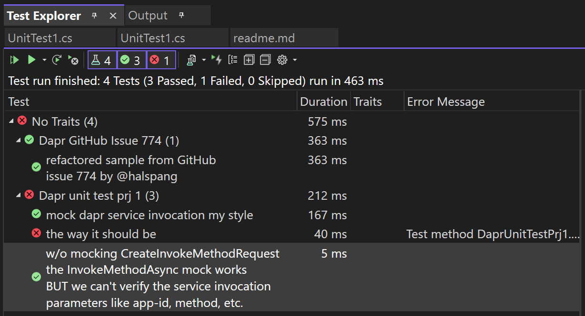

# How can we verify service invocation in Dapr?

I didn't find much on Stack Overflow unfortunatley.  I did find [this GitHub](https://github.com/dapr/dotnet-sdk/issues/774#issuecomment-966721169) w/ a workaround but I couldn't just read it & wrap my head around what it was doing & how to take that pattern & apply it to my work.

---

## Project: `Dapr GitHub Issue 774`
This project is taking @halspang sample code and 
turning it into a fully runnable test.  I had to 
make some changes but I did my best to keep that to a minimum.

## Project: `Dapr unit test prj 1`
This project is me taking what I've learned to write
some sample tests

---

## Tests

---

## Other stuff
I did find [this Stack Overflow question](https://stackoverflow.com/questions/68362431/how-do-you-do-unit-testing-with-dapr)
which seems to be asking basically what I'm asking.