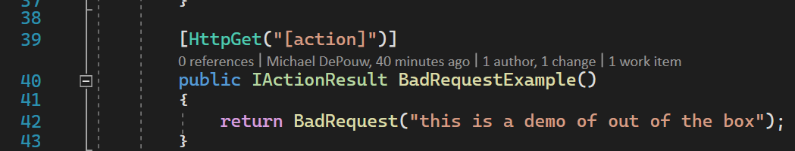
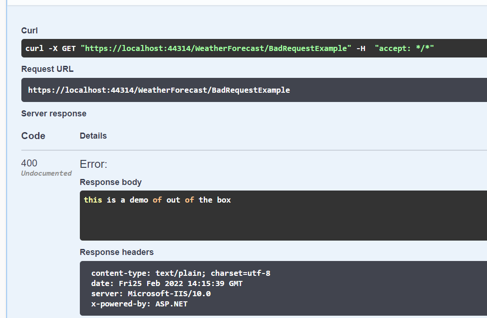
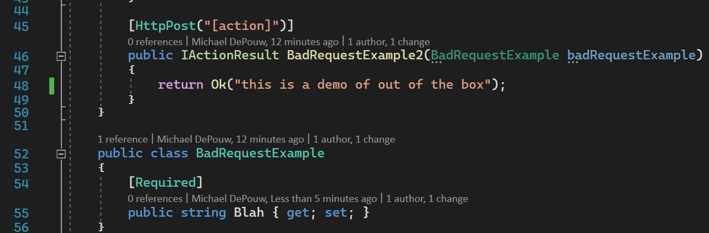
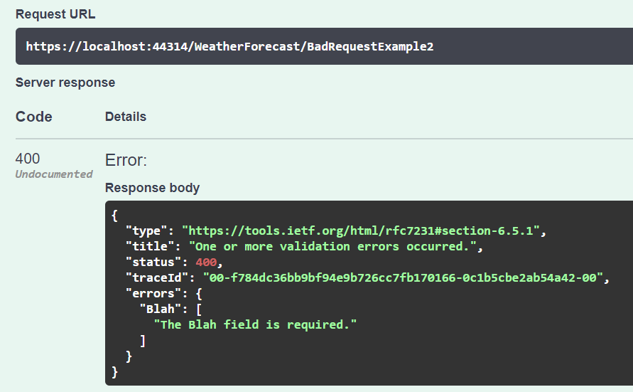

Where is the status code in a `400`/BadRequest coming from?
It's not defualt behavior? 🤔

## Try default method




that's an expected result

## Try Post on ApiController





## More research

>The default response type for an HTTP 400 response is ValidationProblemDetails. 
The following request body is an example of the serialized type:

```json
{
  "type": "https://tools.ietf.org/html/rfc7231#section-6.5.1",
  "title": "One or more validation errors occurred.",
  "status": 400,
  "traceId": "|7fb5e16a-4c8f23bbfc974667.",
  "errors": {
    "": [
      "A non-empty request body is required."
    ]
  }
}
```

[source](https://docs.microsoft.com/en-us/aspnet/core/web-api/?view=aspnetcore-6.0&viewFallbackFrom=aspnetcore-2.1#:~:text=the%20default%20response%20type%20for%20an%20http%20400%20response)

## No way, the http status code is duplicated 😲

That doesn't make sense to me.  What am I missing?  Why would the specification do that? 🤔