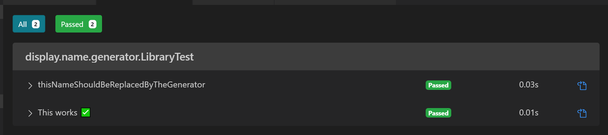
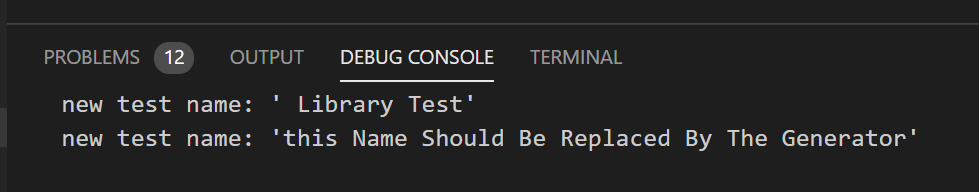

[Building a Camel Case @DisplayNameGenerator For JUnit 5](https://leeturner.me/posts/building-a-camel-case-junit5-displaynamegenerator/)

## VS Code Test Runner Output



## Code is being called 🤔🤷‍♂️



```
private String replaceCapitals(String name) {
  name = name.replaceAll("([A-Z])", " $1");
  name = name.replaceAll("([0-9]+)", " $1");
  System.out.println(String.format("new test name: '%s'", name));
  return name;
}
```