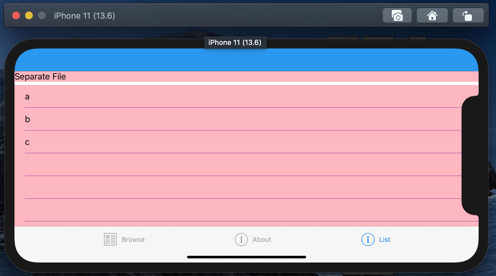
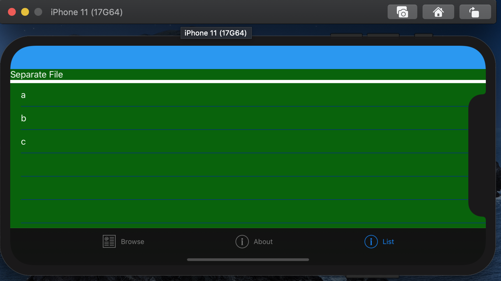
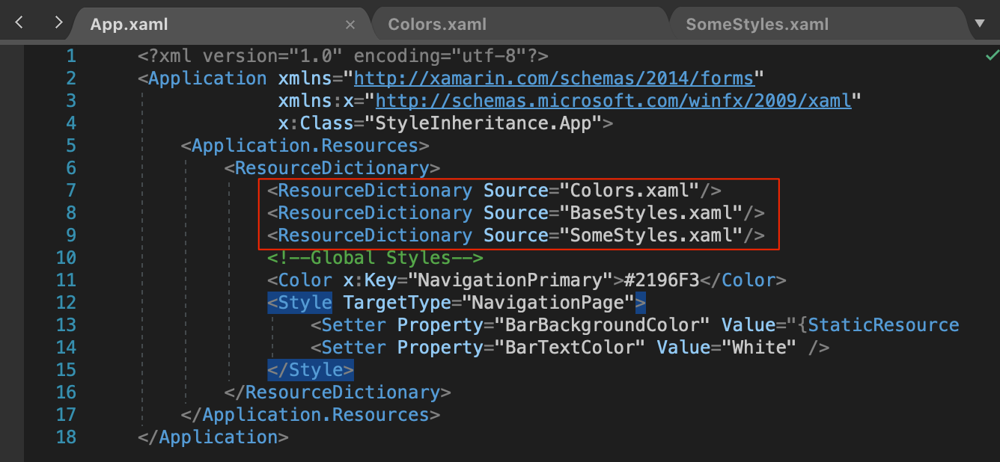
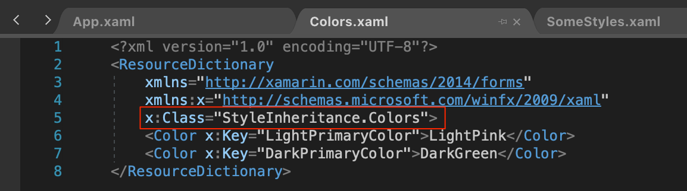
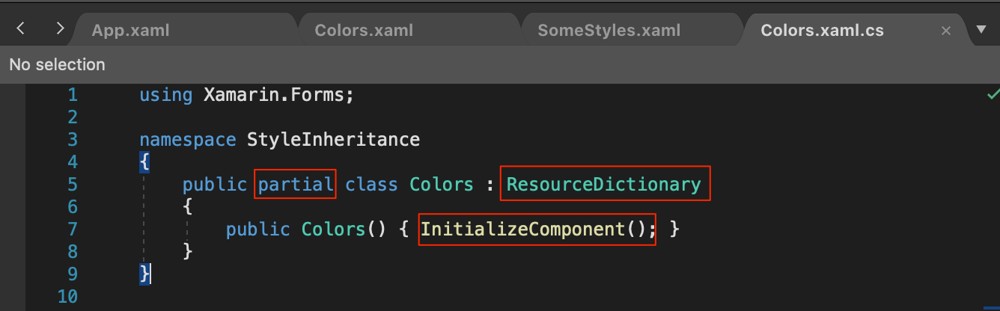

## Problem desc
I want to have separate "style" files; I don't want a huge `App.xaml` with all my shared styles/colors/etc.  I also want to share styles to handle light/dark and I don't want to violate DRY.

### References
[Xamarin Forums: External ResourceDictionary in several projects](https://forums.xamarin.com/discussion/174030/external-resourcedictionary-in-several-projects)

[Better Resource Organization in Xamarin.Forms](https://devblogs.microsoft.com/xamarin/better-resource-organization-xamarin-forms/)

[App Themes for Xamarin.Forms](https://devblogs.microsoft.com/xamarin/app-themes-xamarin-forms/)

[Stack Overflow Question trying to solve the same problem](https://stackoverflow.com/questions/58137147/xamarin-forms-merge-resources)

## Final result
### Light mode

### Dark mode

## Key details

- You can't use the new resources approach.*
- Each separate resource file **NEEDS** to have a code behind file w/ a call to `InitializeComponent()`

\* You can use parts of it but not all of it.  You can reference files via the `Source` property but you can't eliminate `<ResourceDictionary>` in *App.xaml* like [described here](https://devblogs.microsoft.com/xamarin/better-resource-organization-xamarin-forms/#upcoming-resourcedictionary-improvements):
> You can simple write

### App.xaml

### Colors.xaml

### Colors.xaml.cs
