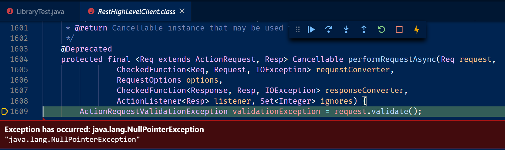
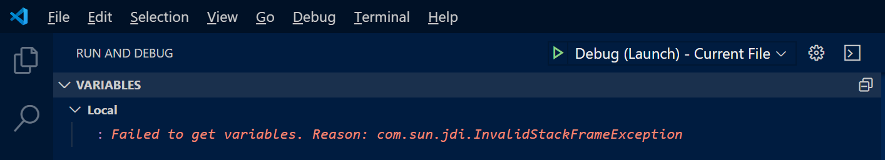
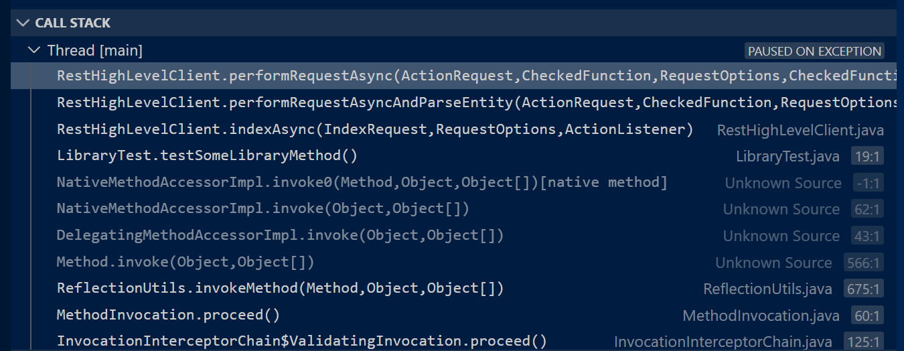
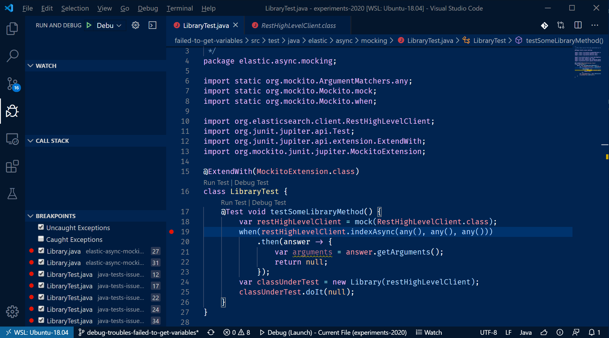

>Failed to get variables. Reason: com.sun.jdi.InvalidStackFrameException

### Repro Steps
1. Debug the test
1. Put a breakpoint on `when(restHighLevelClient.indexAsync(any(), any(), any()))`
1. After the break point is hit, enable Caught Exceptions
1. F5
1. Wait for the exception, inspect the debugger window

