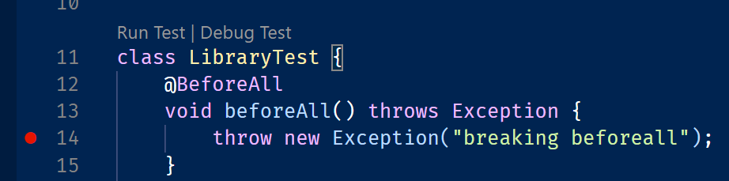
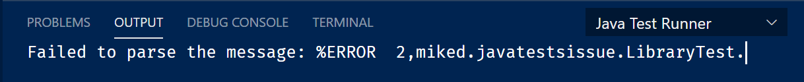
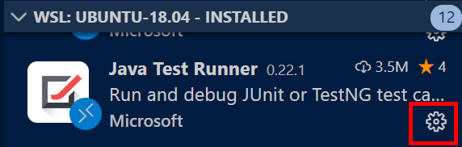
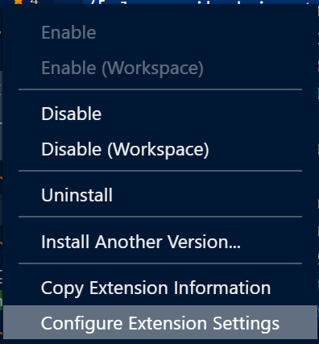

## The problem

Unhandled Exceptions in `@BeforeAll` doesn't tell me what's going on.  It just exits and puts a less than useful error message in the output window.

### Output window

>Failed to parse the message: %ERROR  2,miked.javatestsissue.LibraryTest.

## Debugging it

### Stepping through the code

I see the "real" error:

>Exception has occurred: org.junit.platform.commons.JUnitException
"org.junit.platform.commons.JUnitException: @BeforeAll method 'void miked.javatestsissue.LibraryTest.beforeAll() throws java.lang.Exception' must be static unless the test class is annotated with @TestInstance(Lifecycle.PER_CLASS)."

### Enable Java Test Runner Verbose Logging

>Name: Java Test Runner  
Id: vscjava.vscode-java-test  
Description: Run and debug JUnit or TestNG test cases  
Version: 0.22.1  
Publisher: Microsoft  
VS Marketplace Link: https://marketplace.visualstudio.com/items?itemName=vscjava.vscode-java-test  

>%TESTC  1 v2
%TSTTREE2,miked.javatestsissue.LibraryTest,true,1,false,1,LibraryTest,,[engine:junit-jupiter]/[class:miked.javatestsissue.LibraryTest]
%TSTTREE3,testSomeLibraryMethod(miked.javatestsissue.LibraryTest),false,1,false,2,testSomeLibraryMethod(),,[engine:junit-jupiter]/[class:miked.javatestsissue.LibraryTest]/[method:testSomeLibraryMethod()]
Failed to parse the message: %ERROR  2,miked.javatestsissue.LibraryTest.%ERROR  2,miked.javatestsissue.LibraryTest
%TRACES 
org.junit.platform.commons.JUnitException: @BeforeAll method 'void miked.javatestsissue.LibraryTest.beforeAll() throws java.lang.Exception' must be static unless the test class is annotated with @TestInstance(Lifecycle.PER_CLASS).
	at org.junit.jupiter.engine.descriptor.LifecycleMethodUtils.assertStatic(LifecycleMethodUtils.java:57)
	at org.junit.jupiter.engine.descriptor.LifecycleMethodUtils.lambda$findMethodsAndAssertStatic$0(LifecycleMethodUtils.java:81)
	at java.base/java.util.ArrayList.forEach(ArrayList.java:1540)
	at java.base/java.util.Collections$UnmodifiableCollection.forEach(Collections.java:1085)
	at org.junit.jupiter.engine.descriptor.LifecycleMethodUtils.findMethodsAndAssertStatic(LifecycleMethodUtils.java:81)
	at org.junit.jupiter.engine.descriptor.LifecycleMethodUtils.findBeforeAllMethods(LifecycleMethodUtils.java:40)
	at org.junit.jupiter.engine.descriptor.ClassBasedTestDescriptor.prepare(ClassBasedTestDescriptor.java:161)
	at org.junit.jupiter.engine.descriptor.ClassBasedTestDescriptor.prepare(ClassBasedTestDescriptor.java:77)
	at org.junit.platform.engine.support.hierarchical.NodeTestTask.lambda$prepare$1(NodeTestTask.java:107)
	at org.junit.platform.engine.support.hierarchical.ThrowableCollector.execute(ThrowableCollector.java:73)
	at org.junit.platform.engine.support.hierarchical.NodeTestTask.prepare(NodeTestTask.java:107)
	at org.junit.platform.engine.support.hierarchical.NodeTestTask.execute(NodeTestTask.java:75)
	at java.base/java.util.ArrayList.forEach(ArrayList.java:1540)
	at org.junit.platform.engine.support.hierarchical.SameThreadHierarchicalTestExecutorService.invokeAll(SameThreadHierarchicalTestExecutorService.java:38)
	at org.junit.platform.engine.support.hierarchical.NodeTestTask.lambda$executeRecursively$5(NodeTestTask.java:139)
	at org.junit.platform.engine.support.hierarchical.ThrowableCollector.execute(ThrowableCollector.java:73)
	at org.junit.platform.engine.support.hierarchical.NodeTestTask.lambda$executeRecursively$7(NodeTestTask.java:125)
	at org.junit.platform.engine.support.hierarchical.Node.around(Node.java:135)
	at org.junit.platform.engine.support.hierarchical.NodeTestTask.lambda$executeRecursively$8(NodeTestTask.java:123)
	at org.junit.platform.engine.support.hierarchical.ThrowableCollector.execute(ThrowableCollector.java:73)
	at org.junit.platform.engine.support.hierarchical.NodeTestTask.executeRecursively(NodeTestTask.java:122)
	at org.junit.platform.engine.support.hierarchical.NodeTestTask.execute(NodeTestTask.java:80)
	at org.junit.platform.engine.support.hierarchical.SameThreadHierarchicalTestExecutorService.submit(SameThreadHierarchicalTestExecutorService.java:32)
	at org.junit.platform.engine.support.hierarchical.HierarchicalTestExecutor.execute(HierarchicalTestExecutor.java:57)
	at org.junit.platform.engine.support.hierarchical.HierarchicalTestEngine.execute(HierarchicalTestEngine.java:51)
	at org.junit.platform.launcher.core.DefaultLauncher.execute(DefaultLauncher.java:229)
	at org.junit.platform.launcher.core.DefaultLauncher.lambda$execute$6(DefaultLauncher.java:197)
	at org.junit.platform.launcher.core.DefaultLauncher.withInterceptedStreams(DefaultLauncher.java:211)
	at org.junit.platform.launcher.core.DefaultLauncher.execute(DefaultLauncher.java:191)
	at org.junit.platform.launcher.core.DefaultLauncher.execute(DefaultLauncher.java:137)
	at org.eclipse.jdt.internal.junit5.runner.JUnit5TestReference.run(JUnit5TestReference.java:89)
	at org.eclipse.jdt.internal.junit.runner.TestExecution.run(TestExecution.java:41)
	at org.eclipse.jdt.internal.junit.runner.RemoteTestRunner.runTests(RemoteTestRunner.java:542)
	at org.eclipse.jdt.internal.junit.runner.RemoteTestRunner.runTests(RemoteTestRunner.java:770)
	at org.eclipse.jdt.internal.junit.runner.RemoteTestRunner.run(RemoteTestRunner.java:464)
	at org.eclipse.jdt.internal.junit.runner.RemoteTestRunner.main(RemoteTestRunner.java:210)
%TRACEE 
