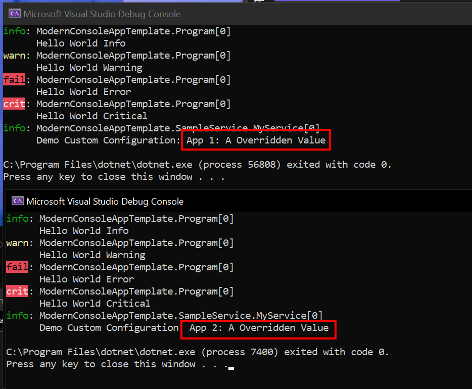
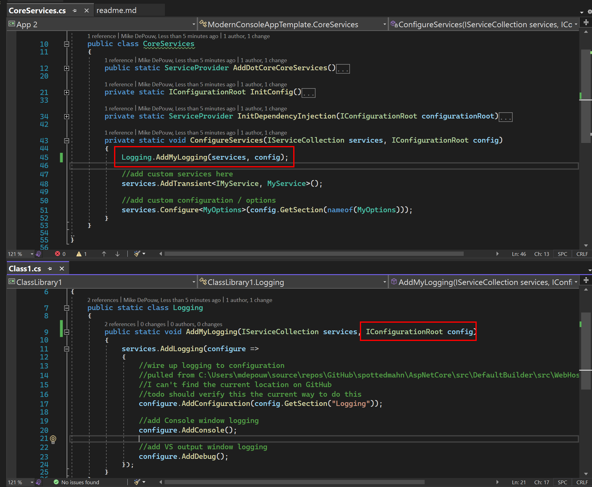
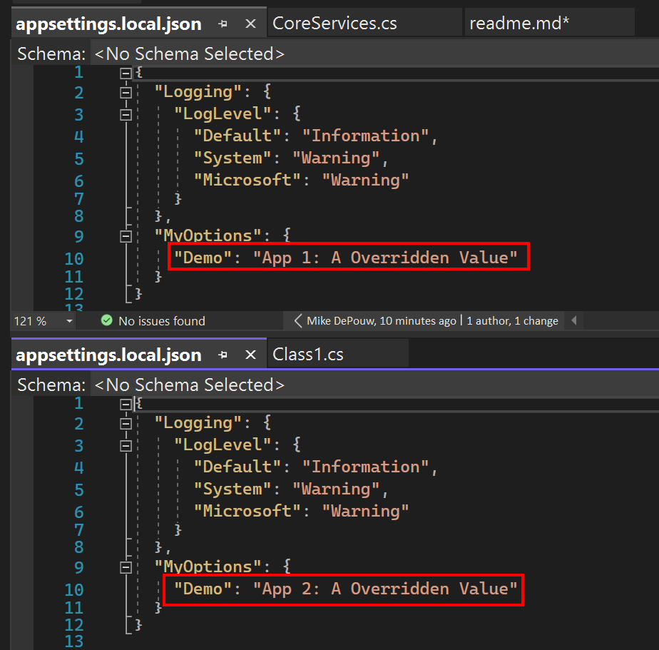

started w/ https://github.com/spottedmahn/turbo-carnival

## Output

## Some code details

- create an extension method that controls
all the `code` for wiring up the logger
to the output source, etc.

## DRY violations ⚠

- this does mean that the config values will be in
every app

