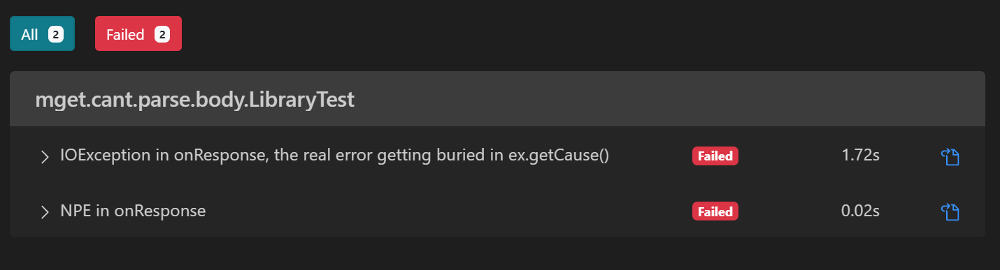
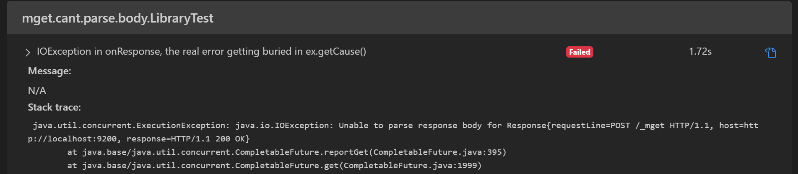
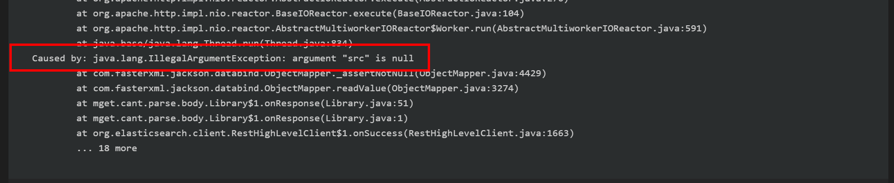
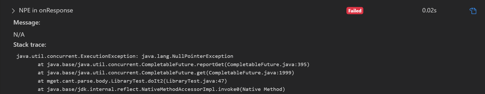

[mget producing: Unable to parse response body for Response](https://stackoverflow.com/questions/60537642/mget-producing-unable-to-parse-response-body-for-response)

## the real problem

## interesting

a NPE shows itself 🤷‍♂️

